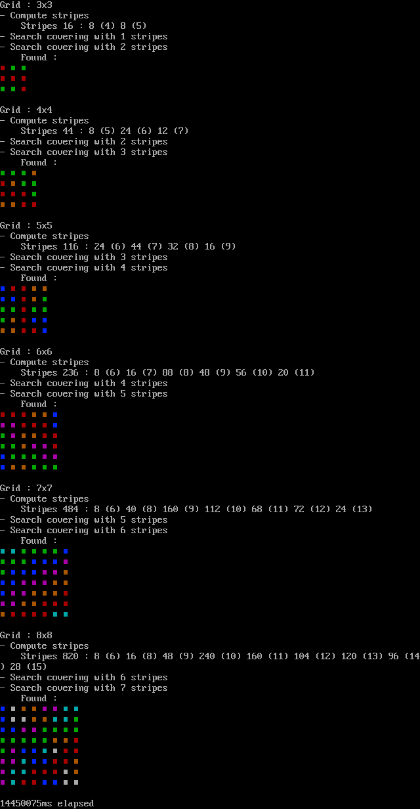

# Diophante J164
see http://www.diophante.fr/problemes-par-themes/jeux-de-plateaux/5430-j164-ratissage-optimal

## Problem statement
What is the least number of straight lines you need to draw across a *n* x *n* square grid so that every cell in the grid has at least one of the lines passing through its interior ?  

## Conjecture
It is conjectured that the answer is *n* - 1 for every *n* ≥ 3.  
One can easliy exhibit a configuration of *n* - 1 straight lines entirely covering the *n* x *n* grid. But it is more difficult to prove that *n* - 1 is the miniumum number, and that no configuration of *n* - 2  lines exists.

## Exploration
This program constitutes a brute force exploration of this conjecture. In particular, it shows that the conjecture holds for all 3 ≤ n ≤ 8.

Program's output is shown below :

